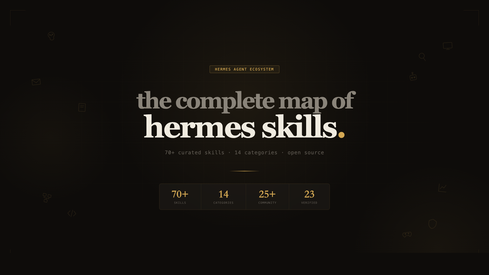

# Hermes Skill Atlas

> The complete, interactive map of [Hermes Agent](https://github.com/nousresearch/hermes) skills — curated, verified, and open source.

[English](#english) · [中文](#中文说明)



---

<a id="english"></a>

## What is this?

A single-file HTML skill browser for the Hermes Agent ecosystem. No build step, no dependencies — just open `article/hermes-skill-cards.html` in any browser.

Every community skill has been **manually verified**: GitHub repos checked for liveness, install commands tested, star counts updated.

## Stats

| Total Skills | Categories | Community | Verified Repos |
|:---:|:---:|:---:|:---:|
| 70+ | 14 | 25+ | 23 |

## Features

- **Interactive cards** — click any skill for details, install commands, and usage tips
- **Multi-platform install** — Hermes / Claude Code / OpenClaw tabs for cross-platform skills
- **Real-time search** — fuzzy search across all skill names, descriptions, and categories
- **Hand-drawn icons** — custom SVG icons for every category
- **Full catalog** — a separate table view with 200+ skills (`hermes-skill-catalog.html`)
- **Zero dependencies** — one HTML file, works offline

## Quick Start

```bash
git clone https://github.com/codesstar/hermes-skill-atlas.git
open hermes-skill-atlas/article/hermes-skill-cards.html
```

Or just download `article/hermes-skill-cards.html` and open it.

## Submit Your Skill

**Found a great skill? Made your own?** We'd love to add it.

The easiest way: [open an issue](https://github.com/codesstar/hermes-skill-atlas/issues/new?template=skill_request.md) — just fill in the skill name, repo link, and a short description. We'll review and add it.

If you prefer PRs, see [CONTRIBUTING.md](CONTRIBUTING.md).

## Data

Structured skill data is available at `data/skills.json` for programmatic access:

```json
{
  "categories": [
    {
      "name": "日常生产力",
      "id": "productivity",
      "skills": [{ "name": "...", "source": "builtin", "install": "..." }]
    }
  ]
}
```

## Project Structure

```
hermes-skill-atlas/
├── article/
│   ├── hermes-skill-cards.html    # Main card browser (精选 70+)
│   └── hermes-skill-catalog.html  # Full table view (200+)
├── data/
│   └── skills.json                # Structured skill data
├── CONTRIBUTING.md
└── LICENSE (MIT)
```

## Credits

- **[Hermes](https://github.com/nousresearch/hermes)** by Nous Research
- **Skill Atlas** by [奇思妙想CYC](https://space.bilibili.com/奇思妙想CYC) (Callum)

---

<a id="中文说明"></a>

## 中文说明

### 这是什么？

Hermes Skill Atlas 是一个交互式技能目录网页，收录了 Hermes Agent 生态中 **70+ 个精选 Skill**，涵盖 14 个分类：日常生产力、搜索研究、记忆系统、写作内容、任务编排、创意可视化、AI Agent 联动、开发者工具、通讯社交、安全红队、娱乐游戏、工作区 GUI，以及奇思妙想CYC 自制的 3 个 Skill。

每一个社区 Skill 都经过了 **人工验证** —— GitHub 仓库确认可用、安装命令实际测试、星数更新为最新。

### 使用方法

```bash
git clone https://github.com/codesstar/hermes-skill-atlas.git
open hermes-skill-atlas/article/hermes-skill-cards.html
```

或者直接下载 `article/hermes-skill-cards.html`，双击打开即可。无需安装任何依赖。

### 提交你的 Skill

**做了自己的 Skill？发现了好用的 Skill？** 欢迎提交！

最简单的方式：[提一个 Issue](https://github.com/codesstar/hermes-skill-atlas/issues/new?template=skill_request.md)，填上 Skill 名字、GitHub 链接、一句话描述就行。我会审核后加入目录。

也可以直接提 PR，详见 [CONTRIBUTING.md](CONTRIBUTING.md)。

### 自制 Skill

| Skill | 说明 | 仓库 |
|-------|------|------|
| [loci](https://github.com/codesstar/loci) | AI 记忆宫殿 — 跨项目、跨会话长期记忆 | codesstar/loci |
| [mbti-personality](https://github.com/codesstar/mbti-personality) | MBTI 人格切换 — 32 种组合 | codesstar/mbti-personality |
| [next-slide](https://github.com/codesstar/next-slide) | 一句话做 PPT — 26+ 设计风格 | codesstar/next-slide |

### 关注

- **B站**：奇思妙想CYC
- **GitHub**：[@codesstar](https://github.com/codesstar)

## License

[MIT](LICENSE)
